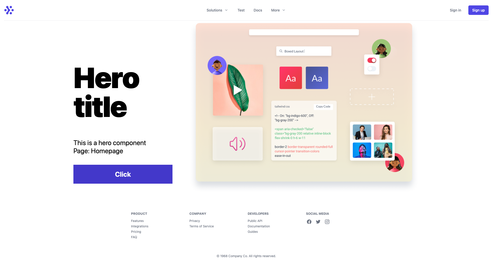
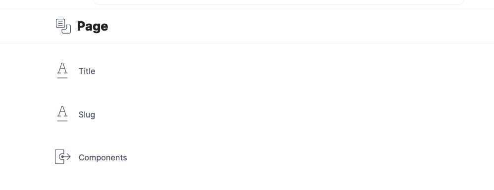
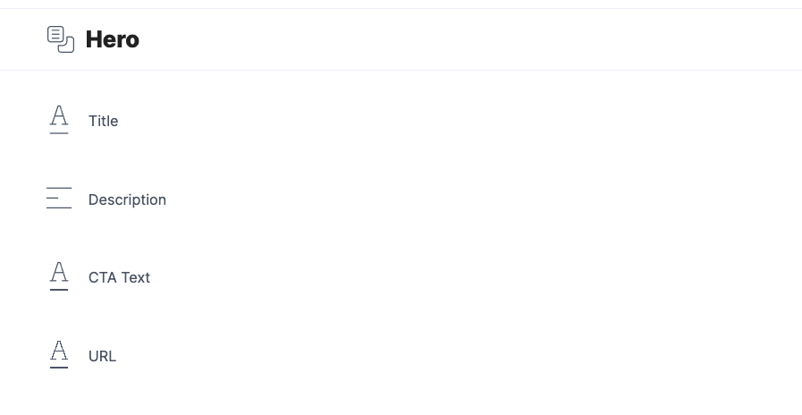
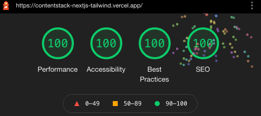

# Contentstack + Next.js + Tailwind CSS

Example project using Next.js with the [Contentstack Delivery API](https://www.contentstack.com/docs/developers/apis/content-delivery-api/), deployed to [Vercel](https://vercel.com).



_Live Example: https://contentstack-nextjs-tailwind.vercel.app/_

_Live Example: https://contentstack-nextjs-tailwind.vercel.app/test_

## Developing

### Env variables

Remember to set up a `.env` file with your contentstack keys.

```env
CONTENTSTACK_STACK_API_KEY=''
CONTENTSTACK_ENVIRONMENT=''
CONTENTSTACK_DELIVERY_TOKEN=''
CONTENTSTACK_REGION='NA'
NEXT_USE_SSR=1
```

If you want to enable SSG please set `NEXT_USE_SSR=0`

<p>
Once you've created a project and installed dependencies with `yarn`, start a development server:

```bash
yarn dev

# or start the server and open the app in a new browser tab
yarn dev -- --open
```

## Building

```bash
yarn build
```

## Content types

This starter kit relies on the following content models.

### Page



- Title, short text.
- Slug, short text
- Components, References - many.

### Hero



- Title, short text.
- Description, short text
- CTA Text, short text
- URL, short text

## Lighthouse score


